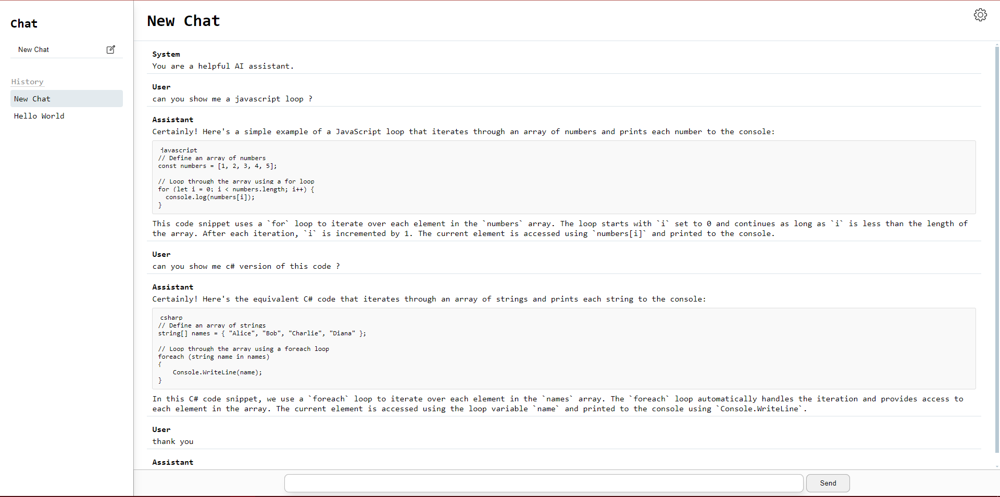
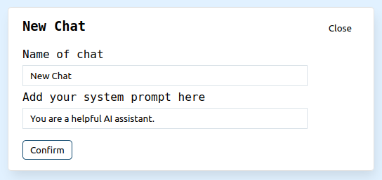
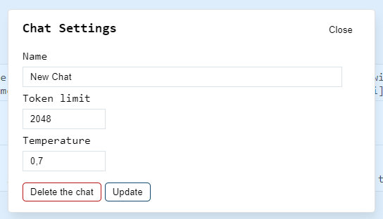

# Pulsar

This application allows you to run an AI model locally.

The frontend is built with Vue.js and Vite, and the backend is built with Python and Flask. \
The user can specify the model name in the `./backend/.env` file or provide a path to a locally downloaded model.

**Note:** This application has only been tested with the following model:
[https://huggingface.co/microsoft/Phi-3-mini-4k-instruct](https://huggingface.co/microsoft/Phi-3-mini-4k-instruct)

## Prerequirement

- [Docker](https://www.docker.com/products/docker-desktop) (for Docker setup)
- [Node.js](https://nodejs.org/en/download/) (for manual frontend setup)
- [Python 3](https://www.python.org/downloads/) (for manual backend setup)

## Setup

### Environment Variables

Create a `.env` file in the `./backend` folder and specify the model path:

```env
MODEL_PATH="microsoft/Phi-3-mini-4k-instruct"
# or
MODEL_PATH="./model/Phi-3-mini-4k-instruct"
```

You can also configure Cross-Origin Resource Sharing (CORS) settings by modifying the `CORS_ORIGINS` variable in the `.env` file:

```env
CORS_ORIGINS="http://localhost:3000/"
```

This setting allows you to control which origins are permitted to access the backend API. Adjust the value as needed to match your frontend URL or other origins that require access.

## Running with Docker

### Build and Run Containers

1. Ensure you have Docker and Docker Compose installed.
2. Open a terminal and navigate to the root of the project directory.
3. Run the following command to build and start the containers:

```sh
docker-compose up --build
```

This will start the frontend on port 3000 and the backend on port 3001.

### Verify GPU Access (Optional)

If using a GPU, verify that Docker can access it:

```sh
docker run --rm --gpus all nvidia/cuda:11.7.1-base-ubuntu20.04 nvidia-smi
```

## Running Manually

### Frontend Setup

1. Navigate to the `./frontend` directory:

```sh
cd frontend
```

2. Install the dependencies:

```sh
npm install
```

3. Start the development server:

```sh
npm run dev
```

The frontend should now be running on port 3000.

### Backend Setup

1. Navigate to the `./backend` directory:

```sh
cd backend
```

2. Create and activate a virtual environment (optional but recommended):

```sh
python -m venv venv
source venv/bin/activate  # On Windows, use `venv\Scripts\activate`
```

3. Install the dependencies:

```sh
pip install -r requirements.txt
```

4. Start the Flask server:

```sh
python app.py
```

The backend should now be running on port 3001.

## Accessing the Application

- Frontend: Open your web browser and go to `http://localhost:3000`
- Backend: The backend API is accessible at `http://localhost:3001`

## Screenshots

Here are some screenshots of the application in action:

### Chat Interface

This is a screenshot of the app with an open conversation:



### New Chat Modal

This is the modal where the user can enter the name of the new chat they want to create and add the system prompt:



### Chat Settings

In this section, the user can change the token limit, temperature, and name of the chat. Each chat has its own settings configuration:



## Notes

- Ensure that the model path specified in the `.env` file is correct.
- When running manually, make sure the backend is started before the frontend if they need to communicate.
- This application has only been tested with the following model:
  [https://huggingface.co/microsoft/Phi-3-mini-4k-instruct](https://huggingface.co/microsoft/Phi-3-mini-4k-instruct)

## Troubleshooting

- If you encounter issues with GPU access in Docker, ensure that the NVIDIA Container Toolkit is properly installed and configured.
- Check the logs for any errors and ensure all dependencies are installed correctly.

## License

This project is licensed under the MIT License.
